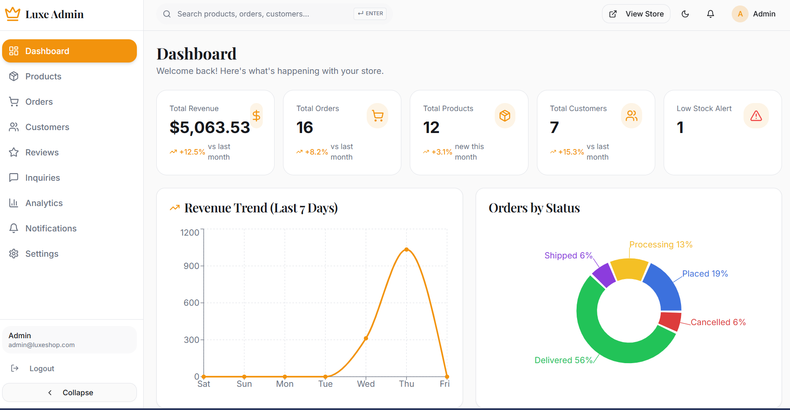
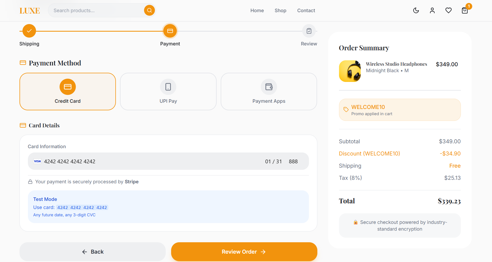

<p align="center">
  
</p>

<h1 align="center">✨ Luxe Shop — Premium Fashion E-Commerce</h1>

<p align="center">
  <strong>A full-stack luxury e-commerce platform with real payments, admin dashboard, and email notifications.</strong>
</p>

<p align="center">
  <a href="https://luxeecom.vercel.app/"></a>
  
  
  
</p>

<p align="center">
  
  
  
  
  
  
  
</p>

---

## 🖥️ Live Preview

> **🌐 [luxeecom.vercel.app](https://luxeecom.vercel.app)**

---

## � Screenshots


| Home Page | Product Details |
| :---: | :---: |
|  |  |

| Shopping Cart | User Dashboard |
| :---: | :---: |
|  |  |

| Admin Dashboard | Stripe Checkout |
| :---: | :---: |
|  |  |

---

## 🎯 What Makes Luxe Shop Special?

This isn't just another e-commerce template. It's a **production-ready**, **fully functional** platform with:

| Feature | Description |
| :--- | :--- |
| 💳 **Real Stripe Payments** | Accept credit cards, debit cards — not a simulation |
| 📧 **Email Notifications** | Order confirmations, contact form replies via Mailtrap / Nodemailer |
| �‍💼 **Admin Dashboard** | 13-page admin panel — manage everything from one place |
| 🔐 **JWT Authentication** | Secure login system for both Users and Admins |
| 🌙 **Dark Mode** | Seamless theme switching across the entire app |
| 📱 **Fully Responsive** | Pixel-perfect on mobile, tablet, and desktop |
| ⚡ **Blazing Fast** | Vite + React SWC for instant load times |
| 🎨 **Premium Animations** | Framer Motion for smooth page transitions and micro-interactions |

---

## 🏗️ Tech Stack

<table>
<tr>
<td width="50%" valign="top">

### Frontend (`/client`)

| Tech | Role |
| :--- | :--- |
| React 18 + Vite | UI Framework + Build Tool |
| TypeScript | Type Safety |
| Tailwind CSS | Utility-first Styling |
| Shadcn/UI + Radix | Component Library |
| Zustand | State Management |
| Framer Motion | Animations |
| React Query | Server State |
| Stripe.js | Payment UI |
| Recharts | Analytics Charts |
| Lucide React | Icon System |

</td>
<td width="50%" valign="top">

### Backend (`/server`)

| Tech | Role |
| :--- | :--- |
| Node.js + Express | API Server |
| MongoDB + Mongoose | Database + ODM |
| JWT + Bcrypt | Auth + Encryption |
| Stripe SDK | Payment Processing |
| Nodemailer | Email Service |
| Multer | File Uploads |

</td>
</tr>
</table>

---

## 📄 Pages & Features Overview

### 🛍️ Customer-Facing (22 Pages)

```
🏠 Home           — Hero section, featured products, stats
🛒 Shop           — Advanced filtering, search, category browse
🔍 Product Detail — Color/size variants, zoom lens, reviews
🛒 Cart           — Quantity controls, coupon codes, order summary
💳 Checkout       — Multi-step: Shipping → Method → Payment → Review
✅ Order Success   — Confirmation + order details
📦 Track Order    — Real-time status tracking
👤 Profile        — Addresses, orders, payment methods, settings
❤️ Wishlist       — Save products for later
🔐 Auth           — Login / Register / Forgot Password
📞 Contact        — Contact form with email delivery
❓ FAQ, About, Careers, Press, Legal Pages
```

### ⚙️ Admin Panel (13 Pages)

```
📊 Dashboard      — Revenue, orders, users at a glance
📦 Products       — Full CRUD with multi-image, variant support
🛒 Orders         — Status management (Placed → Shipped → Delivered)
👥 Customers      — User management with order history
⭐ Reviews        — Moderation and response
📈 Analytics      — Sales charts, growth metrics (Recharts)
🔔 Notifications  — System alerts and admin notifications
📩 Inquiries      — Customer contact form management
⚙️ Settings       — Admin preferences
```

---

## ⚡ Getting Started

### Prerequisites

- **Node.js** v18+
- **MongoDB Atlas** account (or local MongoDB)
- **Stripe** test keys ([dashboard.stripe.com](https://dashboard.stripe.com/test/apikeys))
- **Mailtrap** account ([mailtrap.io](https://mailtrap.io)) _— optional, for emails_

### 1. Clone the Repository

```bash
git clone https://github.com/Tahirali110/Luxe-Shop.git
cd Luxe-Shop
```

### 2. Setup Backend

```bash
cd server
npm install
cp .env.example .env    # Then fill in your keys
```

### 3. Setup Frontend

```bash
cd ../client
npm install
```

### 4. Run Locally

Start **both** servers in separate terminals:

```bash
# Terminal 1 — Backend
cd server
npm run dev          # Runs on http://localhost:5000

# Terminal 2 — Frontend
cd client
npm run dev          # Runs on http://localhost:8080
```

---

## 🔐 Environment Variables

### Backend (`server/.env`)

| Variable | Description |
| :--- | :--- |
| `MONGO_URI` | MongoDB connection string |
| `JWT_SECRET` | Secret key for JWT tokens |
| `STRIPE_SECRET_KEY` | Stripe secret key (starts with `sk_test_`) |
| `STRIPE_PUBLISHABLE_KEY` | Stripe publishable key (starts with `pk_test_`) |
| `SMTP_HOST` | Email server host (e.g., `sandbox.smtp.mailtrap.io`) |
| `SMTP_PORT` | Email server port (e.g., `2525`) |
| `SMTP_USER` | SMTP username |
| `SMTP_PASS` | SMTP password |
| `SMTP_FROM_EMAIL` | Sender email address |
| `SMTP_FROM_NAME` | Sender display name |

### Frontend (`client/.env`)

| Variable | Description |
| :--- | :--- |
| `VITE_API_URL` | Backend API URL (e.g., `https://your-api.vercel.app`) |

> 📝 See [`server/.env.example`](./server/.env.example) for a ready-to-use template.

---

## 🚀 Deployment (Vercel)

This project is deployed as **two separate Vercel projects**:

### Backend
1. Import the repo → Set **Root Directory** to `server`
2. Add all environment variables from `server/.env`
3. `vercel.json` inside `server/` handles routing automatically

### Frontend
1. Import the repo → Set **Root Directory** to `client`
2. **Build Command:** `npm run build`
3. **Output Directory:** `dist`
4. Add `VITE_API_URL` pointing to your backend URL

---

## 📂 Project Structure

```
luxe-shop/
├── client/                    # React Frontend (Vite + TypeScript)
│   ├── src/
│   │   ├── admin/             # Admin Dashboard (13 pages)
│   │   │   ├── components/    # Admin-specific components
│   │   │   ├── pages/         # Dashboard, Products, Orders...
│   │   │   ├── services/      # Admin API services
│   │   │   └── stores/        # Admin state (Zustand)
│   │   ├── components/        # Shared UI components
│   │   │   ├── Checkout/      # Multi-step checkout flow
│   │   │   ├── Hero/          # Landing page hero
│   │   │   ├── Layout/        # Navbar, Footer
│   │   │   ├── Profile/       # User profile sections
│   │   │   └── ui/            # Shadcn UI components (50+)
│   │   ├── pages/             # 22 user-facing pages
│   │   ├── store/             # Zustand stores (auth, cart, wishlist...)
│   │   ├── services/          # API service layer
│   │   └── context/           # Theme context
│   └── public/                # Static assets
│
├── server/                    # Node.js Backend (Express)
│   ├── config/                # Database connection
│   ├── controllers/           # Business logic (6 controllers)
│   ├── middleware/             # Auth & error handling
│   ├── models/                # Mongoose schemas (5 models)
│   ├── routes/                # API routes (7 route files)
│   ├── utils/                 # Email utilities
│   ├── vercel.json            # Vercel serverless config
│   └── server.js              # Express entry point
│
├── .gitignore                 # Security: .env, config.json excluded
└── README.md                  # You are here!
```

---

## 🔗 API Endpoints

| Method | Endpoint | Description |
| :--- | :--- | :--- |
| `POST` | `/api/users/register` | User registration |
| `POST` | `/api/users/login` | User login |
| `GET` | `/api/users/profile` | Get user profile |
| `GET` | `/api/products` | Get all products (with filters) |
| `GET` | `/api/products/:id` | Get single product |
| `POST` | `/api/products` | Create product (Admin) |
| `PUT` | `/api/products/:id` | Update product (Admin) |
| `DELETE` | `/api/products/:id` | Delete product (Admin) |
| `POST` | `/api/orders` | Create new order |
| `GET` | `/api/orders` | Get user orders |
| `PUT` | `/api/orders/:id` | Update order status (Admin) |
| `POST` | `/api/payments/create-intent` | Create Stripe Payment Intent |
| `POST` | `/api/contacts` | Submit contact form |
| `GET` | `/api/notifications` | Get notifications |

---

## 🤝 Contributing

1. Fork the repository
2. Create your feature branch (`git checkout -b feature/amazing-feature`)
3. Commit your changes (`git commit -m 'Add amazing feature'`)
4. Push to the branch (`git push origin feature/amazing-feature`)
5. Open a Pull Request

---

## 📄 License

This project is licensed under the **MIT License**.

---

<p align="center">
  Made with ❤️ by <a href="https://github.com/Tahirali110">Tahirali110</a>
</p>