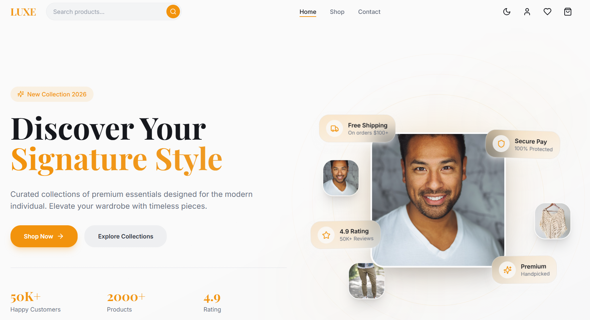
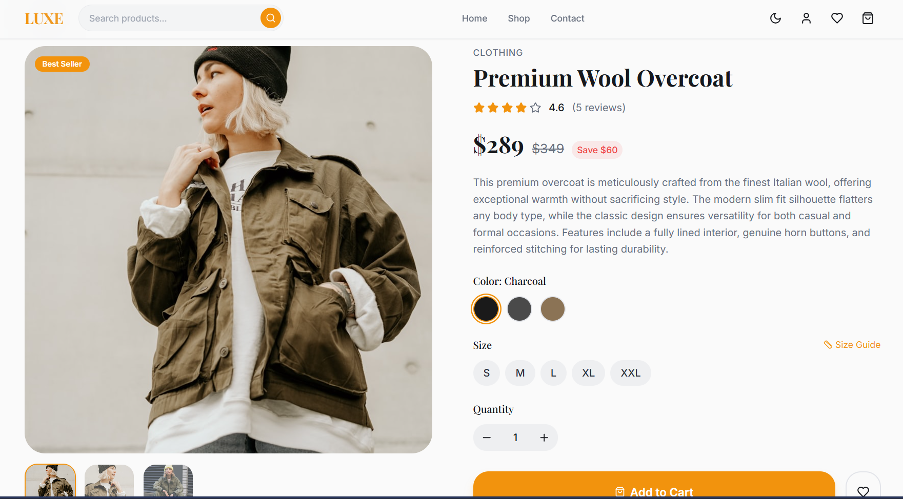
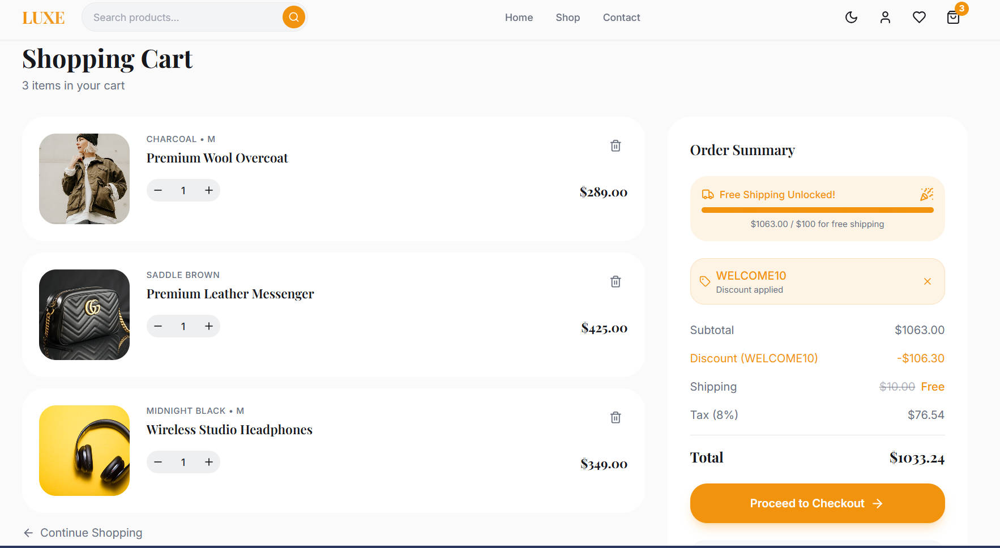
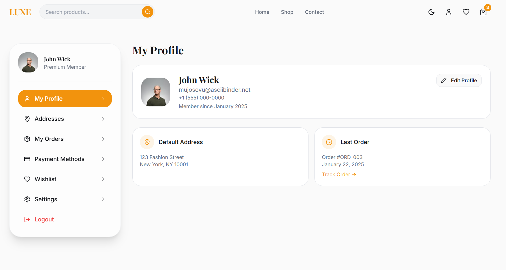

# Luxe Shop - Premium Fashion E-commerce


> A modern, full-stack e-commerce platform built for luxury fashion and accessories. Designed with a focus on a premium user experience, smooth animations, and a robust MERN architecture.


## 📖 About The Project

**Luxe Shop** is more than just an online store; it's an attempt to recreate the luxury shopping experience digitally. The project started with a heavy focus on a highly polished, responsive Frontend using modern UI libraries and is now evolving into a complete MERN stack application.

The goal is to build a scalable, secure, and feature-rich platform that handles everything from product browsing with advanced details to secure checkout and user account management.

### Key Features (Frontend Ready)

* ✨ **Premium UI/UX:** A clean, sophisticated design with seamless light and dark mode support.
* 🔍 **Advanced Product Zoom:** Custom-built "Pin-Lens" magnifying glass effect on product details for a tactile feel.
* 🛒 **Smart Cart & Wishlist:** Persistent cart management and wishlist functionality using modern state management.
* 📱 **Fully Responsive:** Optimized experience across all devices (Mobile, Tablet, Desktop).
* 👤 **User Dashboard UI:** Complete layouts for User Profile, Order History, Address Management, and Settings.
* ⚡ **Blazing Fast:** Built with Vite for instant loading and smooth transitions using Framer Motion.

### 🚀 Upcoming Features (Backend Integration)

* 🔐 **Secure Authentication:** JWT-based login/signup with secure password hashing.
* 🗄️ **Database Integration:** MongoDB to store real products, users, and orders.
* 💳 **Payment Gateway:** Secure checkout integration (e.g., Stripe/Razorpay).
* 👨‍💼 **Admin Panel:** Dedicated dashboard for product inventory and order management.

---

## 🛠️ Tech Stack

This project uses a full JavaScript stack from frontend to backend.

### Frontend (`/client`)
| Technology | Description |
| :--- | :--- |
| **React.js (Vite)** | The core library for building the UI, offering fast HMR. |
| **TypeScript** | For type-safe code and better developer experience. |
| **Tailwind CSS** | A utility-first CSS framework for rapid, responsive styling. |
| **Shadcn UI** | Reusable, accessible components (based on Radix UI). |
| **Framer Motion** | For powering complex animations and page transitions. |
| **Zustand** | A small, fast, and scalable bearbones state-management solution (Cart/Wishlist). |

### Backend (`/server`)
| Technology | Description |
| :--- | :--- |
| **Node.js** | JavaScript runtime environment for the server. |
| **Express.js** | Minimal and flexible Node.js web application framework for building APIs. |
| **MongoDB & Mongoose** | NoSQL database and ODM for data modeling. |
| **JWT (JSON Web Tokens)** | For secure user authentication and authorization. |

---

## 🚀 Deployment (Vercel)

This project is configured for seamless deployment on Vercel.

1.  Push your code to GitHub.
2.  Import the project into Vercel.
3.  Add your environment variables (`MONGO_URI`, `JWT_SECRET`) in the Vercel Project Settings.
4.  Deploy!

## 📸 Screenshots

*(Replace these links with actual screenshots of your application pages. It's crucial for showcasing your work!)*

| Home Page | Product Details |
| :---: | :---: |
|  |  |

| Shopping Cart | User Profile Dashboard |
| :---: | :---: |
|  |  |

---

## ⚡ Getting Started

Follow these steps to set up the project locally on your machine.

### Prerequisites

* Node.js (v16 or higher)
* npm or yarn
* MongoDB installed locally or a MongoDB Atlas connection string.

### Installation

1.  **Clone the repository**
    ```bash
    git clone https://github.com/Tahirali110/Luxe-Shop
    cd luxe-shop
    ```

2.  **Setup Frontend (`client`)**
    ```bash
    cd client
    npm install
    # Create a .env file based on example if needed
    # cp .env.example .env
    ```

3.  **Setup Backend (`server`)**
    ```bash
    cd ../server
    npm install
    # Important: Configure environment variables
    # cp .env.example .env
    ```

### Environment Variables (`server/.env`)

Create a `.env` file in the `server` directory and add the following:

```env
PORT=5000
MONGO_URI=your_mongodb_connection_string_here
JWT_SECRET=your_super_secret_jwt_key
NODE_ENV=development

Running the Application
To run the full stack application locally, you need to run both the frontend and backend servers.

1. Start Backend Server:
cd server
npm run dev # Assuming you have nodemon set up, otherwise 'node server.js'
// Server runs on http://localhost:5000

2. Start Frontend Client (in a new terminal):
cd client
npm run dev
// Client runs on http://localhost:5173 (usually)

Open your browser and navigate to http://localhost:5173 to view the app.

📂 Project Structure
The project follows a standard monorepo-style MERN structure:

luxe-shop/
├── client/           # React Frontend Application (Vite)
│   ├── public/       # Static assets (images, icons)
│   ├── src/          # Components, Pages, Hooks, Context, Styles
│   └── ...
│
├── server/           # Node.js & Express Backend API
│   ├── config/       # Database connection configuration
│   ├── controllers/  # Request handling logic
│   ├── models/       # Mongoose Database Schemas
│   ├── routes/       # API route definitions
│   └── server.js     # Entry point for backend
│
└── README.md         # Project Documentation

